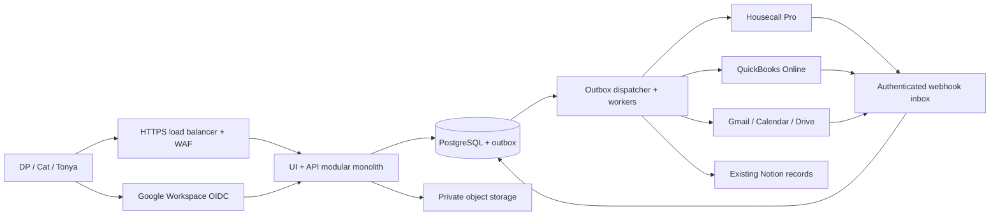

# Platinum Bleu operational dashboard — build specification

Date: September 15, 2026. Status: target architecture with a locally implemented subset. See README.md for tested functionality and remaining launch requirements. No production deployment has occurred.

## 1. Outcome and current authority

Build a private operational application for DP (owner/operator), Cat (Operations/Growth/DP's assistant), and Tonya (Bookkeeper). The requested brand is Platinum Bleu Tree & Land Services. The connected HCP company reports Platinum Bleu Tree and Land Solutions; preserve source identity separately from display branding.

Verified this session: HCP connection succeeds with America/Chicago as company timezone. Notion connects to Platinum Bleu as Catherine. The live [Platinum Bleu HQ](https://app.notion.com/p/3d8401438e5081e18352cf276fd2b344) assigns HCP operational ownership and contains existing DP/Cat dashboards, SOP Library, and Operations Intake & Triage. It requires approval, agreement acceptance, and the required deposit before reserving a production date. Existing pricing/deposit decisions are not assumed approved.

No customer records are included in this specification. HCP credentials, Google integration consent, QBO realm, database provisioning, and production infrastructure must never be inferred from connector availability.

### Data ownership by release

| Domain | Initial operational release | After approved replacement cutover |
|---|---|---|
| Customers, estimates, jobs, invoices, payments | HCP authoritative; application reads projections and submits controlled commands through verified HCP capabilities | App owns customer, estimate, scheduling, and invoice workflow; QBO remains accounting authority |
| Accounting, reconciled payments, tax treatment | QBO accounting authority; connection and existing HCP sync must be inspected | QBO accounting authority, explicit field mapping and reconciliation |
| Tasks, decisions, SOPs | Existing Notion records | Same; no duplicate task database |
| App access, sessions, audit, resource reservations | Application | Application |
| Documents | Existing Drive originals; app records external references | Explicitly designated original per file, with optional replicas |

Never run an app-to-QBO invoice writer alongside an existing HCP-to-QBO invoice writer for the same records. First inventory that integration and choose one owner. A timeout must create an uncertain command state requiring reconciliation, not an automatic second invoice.

## 2. Recommended system

Use a TypeScript modular monolith: browser application, server API, and asynchronous worker from one repository and one versioned release. Deploy API and worker separately for independent resource limits. Use PostgreSQL, private object storage, durable task delivery, and a managed secret store. Suggested infrastructure is Cloud Run, Cloud SQL PostgreSQL, Cloud Storage, Cloud Tasks/Pub/Sub, and Secret Manager, subject to hosting approval.



The first viewport is a work queue: approvals/deposits blocking scheduling, today's jobs, next follow-ups, and exceptions. DP sees approvals and capacity; Cat sees lead follow-up, scheduling, and growth attribution; Tonya sees receivables, invoice exceptions, reconciliation, and job-cost completeness. Unavailable integrations show unavailable/stale states with last successful sync, never zero-valued business metrics.

### Growth strategy

| Approach | Benefits | Costs | Decision |
|---|---|---|---|
| Single undivided application | Fast initial coding | Coupled permissions and data access become hard to change | Avoid; establish module boundaries now |
| Modular monolith plus workers | Atomic transactions, simpler support, shared deployment, separately scaled workloads | Requires discipline around module interfaces | Recommended for the lean team |
| Microservices | Independent releases, scaling, fault isolation | Distributed transactions, network failures, more secrets, deployments, and on-call burden | Extract only proven bottlenecks |

Extract a module when measurements show that it needs materially different scaling or release cadence, repeated failures affect unrelated work, and a named maintainer can own its operational burden. Start with document processing or integration workers; retain transactional scheduling and invoice workflow together. Headcount or a speculative growth multiple alone is not a migration trigger. Test at 10x and 100x a measured initial load; no design can guarantee unlimited growth without changes.

## 3. Authentication, authorization, and sessions

Only Google Workspace OIDC authorization-code flow with PKCE S256, state, and nonce. Configure the OAuth app as internal to the actual Workspace organization where supported. Use a maintained OIDC client library. Validate signature, issuer, audience, expiry, nonce, authorized party where applicable, email_verified, exact hd claim, and exact email domain. The hd request parameter is only a hint. Never trust a decoded token without verification. [Google OIDC documentation](https://developers.google.com/identity/openid-connect/openid-connect).

Allow only platinumbleutls.com AND an active, pre-provisioned membership. Bind the Google issuer/sub pair on the approved member's first login; never use mutable email as the permanent primary identity. No self-signup, passwords, magic links, ChatGPT login, guest accounts, or development bypass in production. Subcontractors who need access must receive company-managed domain accounts and scoped assignments; otherwise they have no app access. Machine-to-machine credentials authenticate narrow webhook/worker endpoints only and cannot create user sessions.

Example callback core (illustrative contract, not a complete authentication implementation):

```ts
const DOMAIN = 'platinumbleutls.com';
// OIDC client consumes single-use server-stored state, verifies PKCE + nonce,
// and verifies signature, issuer, audience, expiry and authorized party.
const claims = await oidc.completeCodeFlow(request, loginTransaction);
const email = claims.email?.trim().toLowerCase();
if (claims.email_verified !== true || claims.hd !== DOMAIN ||
    !email || email.split('@').length !== 2 || email.split('@')[1] !== DOMAIN) {
  throw forbidden('Company Google Workspace account required');
}
// Transaction locks invitation/member row and prevents identity reassignment.
const member = await members.bindApprovedIdentity({
  issuer: claims.iss, subject: claims.sub, email,
});
if (!member || member.status !== 'active') throw forbidden();
const session = await sessions.createOpaque(member); // 256-bit random secret
response.setCookie('__Host-pb_session', session.secret, {
  secure: true, httpOnly: true, sameSite: 'lax', path: '/',
  // No Domain attribute; host-only cookie.
});
```

Persist only a hash of the session secret. Proposed limits: 30-minute inactivity, 12-hour absolute lifetime; reauthentication for membership, integration, and high-risk financial changes. Rotate on login and privilege change. Check active membership and permission version on every request. Domain account suspension should revoke sessions via a verified Workspace lifecycle feed or Directory reconciliation; if that check is required and stale beyond the agreed limit, deny access. Do not claim Google token validity alone detects suspension immediately.

Enforce Workspace MFA/passkeys administratively; recovery stays in the company identity provider. Login rate limits, state expiry, generic failure messages, WAF rules, and suspicious-login alerts supplement provider defenses. Eliminating app passwords removes the app's password-stuffing endpoint, not phishing or session-theft risk.

| Permission | DP | Cat | Tonya | Future roles |
|---|---|---|---|---|
| Customer/job data | All operational | Operational | Billing-required subset | Estimator: assigned prospects; crew: assigned jobs |
| Schedule | Approve/manage | Manage within approved gates | Read as needed | Crew: availability/status only |
| Estimates | Approve pricing exceptions | Draft/follow up | Read financial subset | Estimator: draft assigned estimates |
| Invoices | Approve issue/void exceptions | Draft/status | Prepare/reconcile | No crew/subcontractor access |
| Bank/remittance configuration | Owner-controlled approval | None | Propose/review | None |
| Users/integration grants | Owner admin, audited | None by default | None | Separate admin role if explicitly assigned |
| Documents | Authorized operational | Authorized operational | Financial subset | Assignment and document classification restrictions |

Roles aggregate granular permission keys. Assignment and tenant checks apply in addition to roles. No client-supplied role or tenant is trusted.

```ts
// Route middleware contract: all helpers execute server-side.
const actor = await requireActiveSession(request);
await permissions.require(actor, 'job.schedule');
await db.transaction(async tx => {
  await tx.query("select set_config('app.tenant_id', $1, true)", [actor.tenantId]);
  const job = await jobs.lockAuthorized(tx, actor, request.params.id);
  await gates.requireAgreementAndDeposit(tx, job);
  await reservations.replaceAtomically(tx, job, validatedInput.resources);
  await audit.append(tx, actor, 'job.scheduled', job.id);
  await outbox.append(tx, 'job.schedule.requested', job.id);
});
```

Mutating routes also require CSRF protection and same-origin validation, schema validation, a request-size limit, idempotency keys, and optimistic version checks. Logs record actor, action, resource ID, result, request ID, timestamp, and redacted changes; omit cookies, OAuth tokens, email bodies, and customer document contents. Export audit logs to a separately controlled append-only destination.

## 4. PostgreSQL schema and invariants

PostgreSQL is the primary recommendation because customers, jobs, reservations, invoices, and payments have relational constraints and transactional updates. MongoDB supports transactions but shifts more relationship and scheduling enforcement into application logic. Use PostgreSQL JSONB for provider metadata, not a second primary database. [PostgreSQL constraints](https://www.postgresql.org/docs/18/ddl.html) and [row security](https://www.postgresql.org/docs/17/ddl-rowsecurity.html).

Illustrative foundational DDL; a production migration must add the full audit, import, document, integration, and domain tables described below and be tested against the chosen PostgreSQL version:

```sql
CREATE EXTENSION IF NOT EXISTS pgcrypto;
CREATE EXTENSION IF NOT EXISTS btree_gist;
CREATE TABLE tenants (
  id uuid PRIMARY KEY DEFAULT gen_random_uuid(),
  name text NOT NULL,
  allowed_domain text NOT NULL CHECK (allowed_domain = 'platinumbleutls.com')
);
CREATE TABLE users (
  id uuid PRIMARY KEY DEFAULT gen_random_uuid(),
  issuer text NOT NULL, subject text NOT NULL,
  email text NOT NULL,
  UNIQUE (issuer, subject)
);
CREATE TABLE memberships (
  tenant_id uuid REFERENCES tenants(id), user_id uuid REFERENCES users(id),
  status text NOT NULL CHECK (status IN ('active','suspended')),
  permission_version integer NOT NULL DEFAULT 1,
  PRIMARY KEY (tenant_id, user_id)
);
CREATE TABLE roles (
  tenant_id uuid REFERENCES tenants(id), id uuid DEFAULT gen_random_uuid(),
  name text NOT NULL, PRIMARY KEY (tenant_id,id), UNIQUE (tenant_id,name)
);
CREATE TABLE role_permissions (
  tenant_id uuid, role_id uuid, permission text NOT NULL,
  PRIMARY KEY (tenant_id,role_id,permission),
  FOREIGN KEY (tenant_id,role_id) REFERENCES roles(tenant_id,id)
);
CREATE TABLE member_roles (
  tenant_id uuid, user_id uuid, role_id uuid,
  PRIMARY KEY (tenant_id,user_id,role_id),
  FOREIGN KEY (tenant_id,user_id) REFERENCES memberships(tenant_id,user_id),
  FOREIGN KEY (tenant_id,role_id) REFERENCES roles(tenant_id,id)
);
CREATE TABLE customers (
  tenant_id uuid REFERENCES tenants(id), id uuid DEFAULT gen_random_uuid(),
  display_name text NOT NULL, version integer NOT NULL DEFAULT 1,
  archived_at timestamptz, PRIMARY KEY (tenant_id,id)
);
CREATE TABLE contacts (
  tenant_id uuid, id uuid DEFAULT gen_random_uuid(), customer_id uuid NOT NULL,
  name text, email_normalized text, phone_e164 text,
  PRIMARY KEY (tenant_id,id),
  FOREIGN KEY (tenant_id,customer_id) REFERENCES customers(tenant_id,id)
);
CREATE INDEX contacts_email_match ON contacts(tenant_id,email_normalized);
CREATE INDEX contacts_phone_match ON contacts(tenant_id,phone_e164);
CREATE TABLE jobs (
  tenant_id uuid, id uuid DEFAULT gen_random_uuid(), customer_id uuid NOT NULL,
  status text NOT NULL CHECK (status IN
    ('draft','awaiting_approval','ready','scheduled','in_progress','complete','canceled')),
  version integer NOT NULL DEFAULT 1,
  PRIMARY KEY (tenant_id,id),
  FOREIGN KEY (tenant_id,customer_id) REFERENCES customers(tenant_id,id)
);
CREATE TABLE resources (
  tenant_id uuid REFERENCES tenants(id), id uuid DEFAULT gen_random_uuid(),
  kind text NOT NULL CHECK (kind IN ('person','equipment','crew')),
  name text NOT NULL, PRIMARY KEY (tenant_id,id)
);
CREATE TABLE reservations (
  tenant_id uuid, id uuid DEFAULT gen_random_uuid(), job_id uuid NOT NULL,
  resource_id uuid NOT NULL, during tstzrange NOT NULL,
  status text NOT NULL CHECK (status IN ('held','confirmed','released')),
  PRIMARY KEY (tenant_id,id),
  FOREIGN KEY (tenant_id,job_id) REFERENCES jobs(tenant_id,id),
  FOREIGN KEY (tenant_id,resource_id) REFERENCES resources(tenant_id,id),
  CHECK (NOT isempty(during) AND NOT lower_inf(during) AND NOT upper_inf(during)
    AND lower_inc(during) AND NOT upper_inc(during)),
  EXCLUDE USING gist (tenant_id WITH =, resource_id WITH =, during WITH &&)
    WHERE (status IN ('held','confirmed'))
);
CREATE TABLE leads (
  tenant_id uuid, id uuid DEFAULT gen_random_uuid(), customer_id uuid NOT NULL,
  stage text NOT NULL CHECK (stage IN
    ('new','qualified','estimate','follow_up','won','lost')),
  source text, owner_id uuid, next_action text, next_action_at timestamptz,
  PRIMARY KEY (tenant_id,id),
  FOREIGN KEY (tenant_id,customer_id) REFERENCES customers(tenant_id,id),
  FOREIGN KEY (tenant_id,owner_id) REFERENCES memberships(tenant_id,user_id)
);
CREATE TABLE invoices (
  tenant_id uuid, id uuid DEFAULT gen_random_uuid(), job_id uuid NOT NULL,
  number text, status text NOT NULL CHECK
    (status IN ('draft','approved','issued','part_paid','paid','void')),
  currency char(3) NOT NULL DEFAULT 'USD',
  total_minor bigint NOT NULL CHECK (total_minor >= 0),
  version integer NOT NULL DEFAULT 1,
  PRIMARY KEY (tenant_id,id), UNIQUE (tenant_id,number),
  FOREIGN KEY (tenant_id,job_id) REFERENCES jobs(tenant_id,id)
);
CREATE TABLE invoice_lines (
  tenant_id uuid, invoice_id uuid, id uuid DEFAULT gen_random_uuid(),
  description text NOT NULL, quantity numeric(14,4) NOT NULL CHECK (quantity > 0),
  unit_minor bigint NOT NULL CHECK (unit_minor >= 0),
  tax_minor bigint NOT NULL CHECK (tax_minor >= 0),
  amount_minor bigint NOT NULL CHECK (amount_minor >= 0),
  PRIMARY KEY (tenant_id,id),
  FOREIGN KEY (tenant_id,invoice_id) REFERENCES invoices(tenant_id,id)
);
CREATE TABLE payment_events (
  tenant_id uuid, id uuid DEFAULT gen_random_uuid(), invoice_id uuid NOT NULL,
  provider text NOT NULL, external_id text NOT NULL,
  kind text NOT NULL CHECK (kind IN ('payment','refund','reversal')),
  amount_minor bigint NOT NULL CHECK (amount_minor > 0), occurred_at timestamptz NOT NULL,
  PRIMARY KEY (tenant_id,id), UNIQUE (tenant_id,provider,external_id),
  FOREIGN KEY (tenant_id,invoice_id) REFERENCES invoices(tenant_id,id)
);
CREATE TABLE outbox (
  tenant_id uuid REFERENCES tenants(id), id uuid DEFAULT gen_random_uuid(),
  event_type text NOT NULL, aggregate_id uuid NOT NULL, payload jsonb NOT NULL,
  created_at timestamptz NOT NULL DEFAULT now(), delivered_at timestamptz,
  PRIMARY KEY (tenant_id,id)
);
ALTER TABLE jobs ENABLE ROW LEVEL SECURITY;
ALTER TABLE jobs FORCE ROW LEVEL SECURITY;
CREATE POLICY tenant_jobs ON jobs
  USING (tenant_id = nullif(current_setting('app.tenant_id',true),'')::uuid)
  WITH CHECK (tenant_id = nullif(current_setting('app.tenant_id',true),'')::uuid);
```

Repeat tenant policies on every tenant-owned table. Runtime database role is neither owner nor superuser and has no BYPASSRLS. Migration owner is separate. Tenant context is transaction-local on the same pooled connection. Composite foreign keys prevent cross-tenant references; application assignment permissions further restrict rows and field projections. Tenant support is organizational isolation, not permission to admit other email domains.

Additional required tables: approved_members/invitations; sessions; service_addresses; estimates and immutable estimate_revisions; agreement_acceptances; deposit_requirements; resource_memberships and availability; document_versions; import_batches/import_rows/merge_decisions; audit_events; integration_connections and external_mappings; webhook_inbox and sync_cursors; invoice_approvals and remittance_configuration_versions. Every tenant relationship uses a composite foreign key. Provider mappings include tenant, connection/company, entity type, external ID, local ID, version, and last successful synchronization.

Reserve constituent people/equipment as well as a crew label to prevent double-booking crew members through different crews. Reserve all resources in one transaction, in stable resource-ID order. Model travel/setup buffers as occupied intervals. Expired holds are explicitly released by a worker. Store UTC instants and preserve America/Chicago for display, recurrence, and daylight-saving conversion.

### Imports and deduplication

Upload to staging, validate type/size and CSV formulas on any spreadsheet export, map columns, normalize phones to E.164 using known country context, trim/lowercase emails, and standardize addresses conservatively. Do not strip plus tags or Gmail dots across arbitrary domains. Match provider/company/external ID first. Exact phone/email matches are candidates, not always proof: households and business contacts can share details. Fuzzy name/address matches require review. Never merge automatically on name alone. Record provenance, selected survivor, field-level decisions, and an undo mapping. A stable import row key and unique external mappings make retry safe; quarantine ambiguous rows without blocking valid rows. Preview counts must reconcile to accepted, rejected, duplicate, and pending rows.

### Invoice integrity

Calculate line totals, discounts, tax, rounding, and invoice totals on the server with integer minor units/decimal arithmetic. Issued revisions are immutable: corrections use approved credit/void/reissue flows, not silent edits. Separate payment events from invoice status and derive outstanding balance from reconciled payments, reversals, refunds, and credits. A paid webhook does not prove work completion. Remittance details come from protected company configuration, never invoice free text or a request payload. DP approves sensitive remittance changes; Tonya can review/propose. Preserve an immutable issued PDF hash and revision. Concurrent edits require expected version; reject stale changes with 409.

## 5. Storage and document handling

Use private object buckets with encryption, uniform access policies, opaque tenant-scoped keys, and versioning. Database metadata carries job/customer association, classification, hash, uploader, size/type, scan state, original system, retention category, and legal hold. Authorize each upload/download against the record and field-level role restrictions.

Two-stage upload: issue a narrow upload authorization → upload to quarantine → verify actual type/size/hash and malware scan → mark ready. Serve only ready objects. Short-lived signed downloads are bearer URLs and temporarily bypass interactive login; to interpret the user's strict access requirement literally, stream downloads through the authenticated application rather than issuing shareable signed GET URLs. Upload credentials must not grant download or listing rights. Do not cache protected downloads at a public CDN.

Proposed lifecycle, subject to owner/bookkeeper retention approval: quarantine expires after 7 days; temporary derivatives after 30 days; originals remain until a defined contract/accounting retention schedule permits deletion. Legal holds override expiration. Enable recovery/version retention and test restores before enabling deletion rules. These periods are design proposals, not asserted legal requirements.

Google Drive sync uses existing authorized folders and external IDs; do not create a second master for the same contract. Prefer app-created/explicitly selected files and minimum OAuth scopes; broader Shared Drive sync may need additional read scopes and administrator consent. Persist changes page tokens, process tombstones, and reconcile periodically. [Drive change tracking](https://developers.google.com/workspace/drive/api/guides/manage-changes).

Notion: reuse existing dashboard and Intake record URLs. Private workspace pages are not guaranteed to work as arbitrary iframes. Slice 1 calls the approved Notion API directly at request time, verifies the token's bot workspace, queries only the configured Operations Intake & Triage data source, and returns role-filtered fields with authenticated deep links. It does not cache or write Notion content. The data source must be explicitly shared to the integration, and integration access is not proof that every app user may read it; application RBAC therefore limits the command center to owner and Operations roles. Never publish private pages to make embedding work.

## 6. API contract

Base path /api/v1. JSON request/response schemas; ISO 8601 timestamps; currency + integer minor units. Cursor pagination with a maximum page size. Derive tenant from session. UUID object IDs confer no access by themselves. All mutations require CSRF controls, Idempotency-Key, and expected version where modifying existing records. Same key with a different request hash returns 409.

| Endpoint | Permission and behavior | Response |
|---|---|---|
| GET /me | Active session; current role/permission summary | 200 identity; 401 expired |
| GET /command-center | command.read; DP or Cat projection from live read-only Notion data | 200 explicit ready, empty, stale, unavailable, or integration_error state |
| GET /dashboard | Permission-filtered queues, freshness, partial failures | 200 with source timestamps |
| POST /imports/customers | customer.import; staging only | 202 batch ID |
| GET /imports/{id} | Import owner or authorized manager | 200 counts and review candidates |
| POST /imports/{id}/commit | customer.import; approved mappings and merge decisions | 202 command ID |
| GET /customers?cursor= | customer.read; billing/assignment projection | 200 paged subset |
| GET /jobs?from=&to= | job.read; explicit interval/timezone | 200 jobs + freshness |
| POST /jobs/{id}/schedule | job.schedule; agreement/deposit/capacity gates | 202 provider command; 409 conflict; 422 failed gate |
| PATCH /leads/{id} | lead.manage; stage, next action, owner | 200 version; 409 stale |
| POST /invoices/{id}/approve | invoice.approve; immutable approval snapshot | 200 approved revision |
| POST /invoices/{id}/issue | invoice.issue; approved revision and remittance version | 202 command ID |
| POST /documents/uploads | document.create; classification and related record | 201 upload ID and scoped upload authorization |
| GET /documents/{id}/content | document.read; scan-ready and record ACL | 200 streamed content; 404 unauthorized object |
| GET /integrations/status | integration.status; redacted health | 200 connection/reconciliation state |
| POST /integrations/{provider}/connect | Owner permission + fresh authentication | Redirect to provider consent |
| POST /webhooks/{provider}/{connection} | Provider verification; no user-session creation | 2xx after durable acceptance |

```json
{
  "expectedVersion": 3,
  "startsAt": "2026-10-07T14:00:00Z",
  "endsAt": "2026-10-07T18:00:00Z",
  "timeZone": "America/Chicago",
  "resourceIds": ["<authorized-resource-uuid>"]
}
```

An accepted asynchronous response contains commandId, status='pending', and statusUrl. UI distinguishes pending, applied, rejected, and uncertain. Provider projections remain provider-confirmed; do not display an optimistic local command as a confirmed reservation/payment. The app's local capacity locks cannot prevent independent HCP users from scheduling; reconcile immediately before commands and raise detected conflicts.

## 7. Integrations and delivery semantics

Connection records bind a provider account/company/realm to a tenant, approved scopes, cursor, token reference, and health. Tokens stay encrypted in Secret Manager or an encrypted token vault, not frontend storage, logs, Notion, or Git. Serialize refresh-token rotation per connection and atomically retain the latest returned token.

```yaml
# Illustrative configuration; not deployed values or secrets.
APP_ORIGIN: https://ops.platinumbleutls.com
ALLOWED_EMAIL_DOMAIN: platinumbleutls.com
GOOGLE_OIDC_ISSUER: https://accounts.google.com
GOOGLE_LOGIN_SCOPES: openid email
GOOGLE_CALLBACK_PATH: /auth/google/callback
QBO_SCOPES: com.intuit.quickbooks.accounting
QBO_CALLBACK_PATH: /integrations/quickbooks/callback
GMAIL_SCOPES: https://www.googleapis.com/auth/gmail.metadata
CALENDAR_SCOPES: https://www.googleapis.com/auth/calendar.events
DRIVE_SCOPES: https://www.googleapis.com/auth/drive.file
TOKEN_STORAGE: secret-manager-reference
```

Login scopes and connector consent are separate. Metadata-only Gmail logging is the initial proposal; full bodies/attachments require explicit access and retention approval plus appropriate scopes. Only connect the designated business mailboxes. No domain-wide delegation by default. Provider approval/verification obligations must be checked for the actual internal/external app configuration before launch.

### QuickBooks Online

Use QBO OAuth 2.0 with connection-bound state and verified realmId. Two directions mean explicitly owned fields, not unrestricted last-write-wins: approved app invoice commands outbound only after the HCP writer is retired for those records; QBO accounting/payment/tax results inbound. During HCP coexistence, read/reconcile unless a single writer has been explicitly selected. Use entity ID + current SyncToken for updates; stale versions trigger fetch-and-review, never blind overwrite. [Intuit SyncToken reference](https://static.developer.intuit.com/sdkdocs/qbv3doc/ippdotnetdevkitv3/html/5d539a7b-9e16-5085-3ecc-e0ab5dff7504.htm).

Verify current QBO webhook payload/signature requirements against the configured app before implementing the receiver. Expected pattern is HMAC verification of raw body using the webhook verifier token and constant-time comparison; the current webhooks documentation could not be retrieved in this session, so the exact contract remains a validation gate. Notifications trigger authoritative fetches and reconciliation; payment/refund/void events are preserved. Compare currency, customer, totals, balance, and mapped invoice IDs nightly. Use provider idempotency features where verified; uncertain create responses require lookup/reconciliation before retry.

### Gmail

Register users.watch to a Pub/Sub topic with the required Gmail publisher permission. Authenticate Pub/Sub push identity and audience, validate mailbox-to-connection mapping, and dedupe message IDs. Read history deltas from the stored historyId; persist progress after durable processing. Renew watches daily and recover expired history with a bounded full sync. Notifications may be delayed or dropped, so reconcile periodically. [Gmail push guide](https://developers.google.com/workspace/gmail/api/guides/push).

### Google Calendar

Use a designated business scheduling calendar. App/HCP schedule is authoritative for production; Calendar is a federated view. External edits become proposed changes checked against deposits, approval, capacity, and timezone rules. Store event IDs, etags, and sync tokens. Paginate incremental sync and perform full resync on 410 invalid token. Renew expiring notification channels, validate channel token/resource identity, and tolerate notifications arriving before watch setup response. [Calendar incremental sync](https://developers.google.com/workspace/calendar/api/guides/sync).

### Reliable webhooks and outbox

1. Verify each provider using its actual protocol (HMAC, signed Pub/Sub JWT, or registered channel token); never apply one generic signature algorithm to all providers.
2. Limit raw body size and persist an inbox item with unique connection/event identity; return success after durable acceptance.
3. Worker acquires a lease, fetches canonical entity state, checks source version, and applies changes transactionally with audit + outbox.
4. Retry transient failures with exponential backoff/jitter and Retry-After handling. Bound retries; send failures to an owned dead-letter queue.
5. Replays use the same idempotency record; duplicate delivery is successful and does not repeat side effects.
6. Version-aware reconciliation handles out-of-order events; daily comparison repairs missing notifications. Exactly-once business effects require idempotency, not a claim of exactly-once transport.

Outbound events include tenant/connection, aggregate ID/version, event ID, origin, correlation ID, and schema version. Prevent loops by field ownership and source versions, not just a timestamp. Treat provider payloads as untrusted input. Encrypt raw event payloads if temporarily retained, restrict access, and expire them on a short approved schedule.

## 8. Domain, deployment, and security hardening

Proposed subdomain: ops.platinumbleutls.com; it has not been provisioned. Keep the marketing website separate. DNS changes and certificates require approved account access. Terminate TLS at a managed HTTPS load balancer, redirect HTTP, enforce modern TLS, and enable HSTS after all affected hostnames are verified. Restrict backend ingress to the load balancer; do not leave an alternate default service URL exposing protected routes. Protect UI, API, document, and export routes at the server.

CDN caches only immutable public build assets. Authenticated HTML/API/downloads use Cache-Control: private, no-store and must bypass shared caching. Start with one region and a highly available PostgreSQL primary, PITR, tested backups, bounded database pools, and maximum service-instance limits. Global edge delivery does not make the database multi-region. Add a secondary region only after tested restore/failover and latency evidence justify it; keep one write authority for financial/scheduling correctness.

Cloud Run manages container scheduling and autoscaling without a Kubernetes control plane. Configure resource limits, concurrency, minimum/maximum instances, readiness, structured logs, and health alerts; database capacity must bound aggregate connections. [Cloud Run autoscaling](https://docs.cloud.google.com/run/docs/about-instance-autoscaling). Adopt Kubernetes only for requirements Cloud Run cannot meet and when a named operations owner can maintain it.

Containers run non-root with minimal images and no baked secrets. Separate production/staging projects and databases; deploy through short-lived CI workload identity. Dependency scanning, lockfiles, automated backups, budget alerts, WAF/rate limits, CSP, output escaping, parameterized SQL, CSRF, strict origin handling, and restrictive CORS are launch requirements. Avoid customer PII in analytics/session replay. Sanitize exports against spreadsheet formula injection. Restrict arbitrary outbound URLs to avoid SSRF, including file imports and webhook configuration.

Proposed service objectives, to validate before committing: 99.9% business-app availability; normal sync freshness under 2 minutes; operational alert at 15 minutes of staleness; backup RPO 15 minutes and recovery RTO 4 hours. These are targets, not verified provider guarantees. Monitor failed logins, access changes, financial configuration changes, queue age, dead letters, failed token refreshes, missing reconciliation, backup success, and restore drills.

## 9. Build sequence and definition of done

1. Confirm compliant hosting and source-of-truth boundary. Inspect existing HCP/QBO sync and the actual API permissions. Owner provisions approved Google OAuth configuration and non-secret team email identities through secure setup.
2. Implement Google-only login, memberships, sessions, audit, tenant isolation, and role-restricted navigation. No production bypass; missing configuration fails closed.
3. Deliver read-only HCP operational projections plus existing Notion links, with pagination, freshness, and outage states. Validate role views without copying unnecessary PII.
4. Implement import staging, follow-up, resource allocation, agreement/deposit gates, and controlled HCP commands against a safe test dataset. Add private document workflow.
5. Implement QBO reconciliation, authorized Gmail metadata logging, Calendar federation, and Drive references/sync with webhook replay tests.
6. Complete staging security and operational tests; inspect responsive UI for DP/Cat/Tonya. Production activation requires owner-approved OAuth, cloud billing/resources, DNS, integration consent, and any handling of real client data in the new system.
7. Only after a separate replacement decision: rehearse backfill, compare record totals and financial balances, freeze writers, apply final deltas, switch one domain at a time, observe, and retain rollback/export capability. Never promise rollback by overwriting financial changes made after cutover.

### Required acceptance evidence

- Outside-domain, consumer Google, unapproved-domain-member, forged claims, expired token, replayed callback, and revoked/suspended membership cannot enter.
- No password, magic-link, ChatGPT, guest, query-parameter, or development bypass reaches protected data. Documents and exports have equivalent authorization.
- Cross-tenant and cross-assignment requests fail at API and database layers, including guessed IDs, exports, and jobs with mixed resources.
- Two simultaneous resource bookings cannot both succeed; daylight-saving transitions, travel buffers, released holds, and constituent crew overlaps work.
- Agreement/deposit gates reject scheduling with missing or stale evidence; provider rejection restores a consistent local reservation/command state.
- Duplicate customer import and replayed provider events do not duplicate records. Ambiguous matches remain reviewable.
- Concurrent invoice edits conflict; issued revisions cannot change silently; remittance changes require approval; payment/refund replay produces one financial effect.
- Provider outage, 429, expired grants, malformed hooks, old events, queue restart, and invalid sync cursor recover without reporting false business state.
- Database restore and document recovery succeed in staging; backup objectives are measured. No credentials or client data leak through logs or builds.
- One representative lead-to-closeout journey and each role's permitted/forbidden actions pass in the deployed app before production readiness is claimed.

## 10. Current delivery boundary

This document describes the target architecture. The repository now contains a locally tested dashboard implementation; see the README for the implemented subset and remaining launch requirements. Local tests do not establish live integration, Cloud SQL, or production readiness.

The user selected Google Cloud Run and PostgreSQL. Sites hosting is not used because a compliant Google Workspace-only authentication path was not established. The company-owned Google Cloud project, OAuth configuration, provider grants, billing, DNS, and production activation still require owner setup and authorization.
